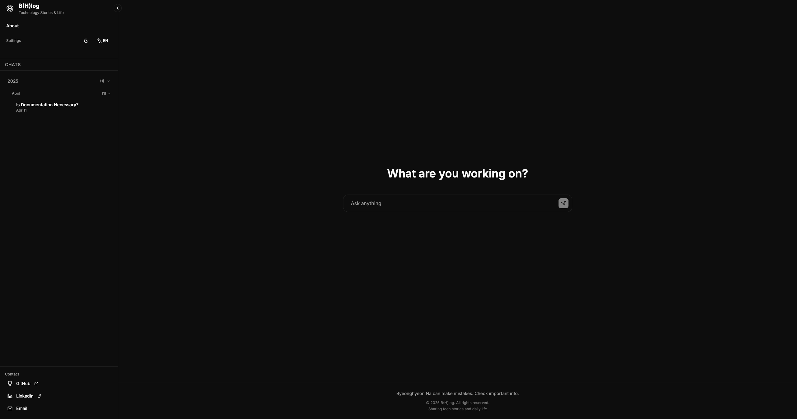

# B(H)log - Personal Blog with Chat Interface



[](https://nextjs.org/)
[](https://www.typescriptlang.org/)
[](https://pages.cloudflare.com/)
[](https://www.anthropic.com/)

[한국어로 읽기](https://github.com/iamb0ttle/my-blog/blob/main/docs/README-ko.md)

A modern personal blog with a ChatBot-style interface built with Next.js 14, featuring dark/light mode, internationalization (Korean/English), and a unique chat bubble post layout.

## ✨ Features

- **Chat-style Interface**: Posts are displayed as alternating chat bubbles (user/bot style)
- **Internationalization**: Full support for Korean and English with `next-intl`
- **Dark/Light Mode**: Seamless theme switching with system preference detection
- **MDX Support**: Rich content with custom components and syntax highlighting
- **Resizable Sidebar**: Draggable sidebar with persistent width settings
- **Advanced Search**: Full-text search with highlighting and filters
- **Comments**: Integrated Giscus comments system
- **Responsive Design**: Mobile-first approach with Tailwind CSS
- **Static Export**: Ready for deployment to GitHub Pages or any static hosting
- **SEO Optimized**: Structured data, meta tags, and sitemap generation

## 🛠 Tech Stack

- **Framework**: Next.js 14 (App Router)
- **Language**: TypeScript
- **Styling**: Tailwind CSS
- **Content**: MDX with `next-mdx-remote`
- **Internationalization**: `next-intl`
- **Comments**: Giscus
- **Icons**: Lucide React
- **Deployment**: GitHub Pages / Vercel

## 📁 Project Structure

```
my-blog/
├── src/
│   ├── app/                 # Next.js App Router
│   │   ├── [locale]/        # Internationalized routes
│   │   └── globals.css      # Global styles
│   ├── components/          # React components
│   │   ├── ChatInterface.tsx
│   │   ├── PostContent.tsx
│   │   ├── Sidebar.tsx
│   │   ├── Giscus.tsx
│   │   └── WelcomeMessage.tsx
│   ├── content/             # MDX blog posts
│   │   ├── en/              # English posts
│   │   └── ko/              # Korean posts
│   ├── lib/                 # Utility functions
│   └── messages/            # i18n translations
├── public/                  # Static assets
├── .github/workflows/       # GitHub Actions
└── package.json
```

## 🚀 Getting Started

### Prerequisites

- Node.js 18.0 or later
- npm or yarn

### Installation

1. Clone the repository:
```bash
git clone <repository-url>
cd my-blog
```

2. Install dependencies:
```bash
npm install
```

3. Run the development server:
```bash
npm run dev
```

4. Open [http://localhost:3000](http://localhost:3000) in your browser.

## 📝 Content Management

### Adding New Posts

1. Create a new MDX file in the appropriate language folder:
   - Korean: `src/content/ko/your-post-slug.mdx`
   - English: `src/content/en/your-post-slug.mdx`

2. Add frontmatter to your MDX file:
```mdx
---
title: "Your Post Title"
excerpt: "A brief description of your post"
date: "2024-01-01"
tags: ["nextjs", "react", "blog"]
readingTime: 5
---

# Your First Section (User message)

This will appear as a user message bubble.

# Bot Response

This will appear as a bot response bubble.

# Another User Message

Posts alternate between user and bot style automatically.
```

### Post Structure

Posts are automatically split into chat bubbles based on `# H1` headings:
- **Even indices (0, 2, 4...)**: User messages (right-aligned, primary color)
- **Odd indices (1, 3, 5...)**: Bot responses (left-aligned, card background)

## 🎨 Customization

### Theme Configuration

Modify `tailwind.config.js` to customize colors and themes:

```js
module.exports = {
  theme: {
    extend: {
      colors: {
        primary: {
          // Your custom primary colors
        }
      }
    }
  }
}
```

### Giscus Comments

Update the Giscus configuration in `src/components/Giscus.tsx`:

1. Replace the placeholder values with your repository information
2. Configure category and other settings according to your needs

### Modify Some React Componets & ./src/messages
Additionally, modify some hard-coded information in React Component and `./src/messages` to suit your information

## 📦 Deployment

### GitHub Pages

The project is configured for automatic deployment to GitHub Pages using GitHub Actions.

1. Push to the `main` branch
2. GitHub Actions will automatically build and deploy to GitHub Pages

### Manual Deployment

```bash
# Build and export static files
npm run build

# The static files will be in the 'out' directory
# Upload to your preferred static hosting service
```

### Vercel (Alternative)

Simply connect your GitHub repository to Vercel for automatic deployments.

## 🌐 Internationalization

The blog supports Korean and English:

- **URLs**: `/ko/post/slug` or `/en/post/slug`
- **Messages**: Stored in `src/messages/[locale].json`
- **Content**: Separate MDX files for each language

### Adding New Languages

1. Create message files: `src/messages/[locale].json`
2. Add locale to `src/lib/i18n.ts`
3. Update middleware configuration
4. Create content folders: `src/content/[locale]/`

## 🛠 Available Scripts

- `npm run dev` - Start development server
- `npm run build` - Build for production
- `npm run start` - Start production server
- `npm run lint` - Run ESLint
- `npm run type-check` - Run TypeScript type checking
- `npm run deploy` - Build and export for static hosting

## 🎯 Key Features Explained

### Chat Interface

The unique chat interface transforms traditional blog posts into a conversational format, making content more engaging and easier to read.

### Resizable Sidebar

The sidebar width is:
- Draggable on desktop
- Persistent across sessions
- Collapsible for more reading space
- Responsive on mobile devices

### Advanced Search

Full-text search includes:
- Content highlighting
- Filter by tags
- Sort by date/title/reading time
- Search result snippets

### Performance Optimizations

- Static export support
- Optimized bundle size
- Image optimization
- CSS compression
- Component lazy loading

## 📄 License

This project is open source and available under the [MIT License](LICENSE).

## 🤝 Contributing

Contributions are welcome! Please feel free to submit a Pull Request.

## 📧 Contact

- GitHub: [iamb0ttle](https://github.com/iamb0ttle)
- Email: nbhyun0329@gmail.com
- LinkedIn: [byeonghyeon-na](https://www.linkedin.com/in/byeonghyeon-na/)

---

Built with ❤️ using Next.js 14, TypeScript and my fantastic ultra-think co-worker Claude Code 😎