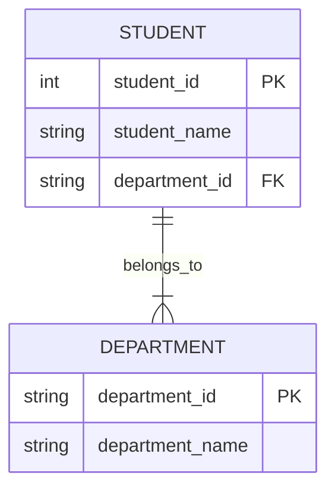

# Overview
*This document summarizes database normalization along with examples to help quickly review and reinforce the concepts.*

# Introduction
Normalization is one of the key concepts in relational database systems. It is a technique used to resolve **anomalies** that can occur in relational databases.

Normalization was first proposed by **Dr. Edgar F. Codd**, a computer scientist who established the theoretical foundation of relational databases. In 1970, he published a paper titled _“A Relational Model of Data for Large Shared Data Banks,”_ where he introduced the concept of relational databases and highlighted the data anomaly problems that can arise within them.

To address these issues, Dr. Codd introduced the concept of **data normalization**, defining the First, Second, and Third Normal Forms (1NF, 2NF, 3NF). Later, researchers such as **Raymond F. Boyce** and **Ron Fagin** extended this work with **Boyce-Codd Normal Form (BCNF)**, **Fourth Normal Form (4NF)**, and **Fifth Normal Form (5NF)**.

Therefore, normalization is an essential concept for resolving data anomalies in relational databases. This document provides a clear summary of the topic along with examples to facilitate understanding.

# What is Normalization?
**Normalization** is the process of structuring tables in a relational database to **minimize data redundancy** and **ensure data integrity**, thereby resolving potential data anomaly issues. The main goal of normalization is to prevent issues in advance and to create a database structure that is maintainable and logically organized.

Normalization is divided into stages—**1NF, 2NF, 3NF, BCNF, 4NF, and 5NF**—which progressively reduce problems that can arise within a table. Each level of normalization enforces stricter structural rules, resulting in a more consistent and reliable schema.

Importantly, to achieve a certain level of normalization, **all previous levels must also be satisfied**.

# 1NF (First Normal Form)
1NF is the first level of normalization. It requires that **all columns in a table must have atomic values**, meaning that each value at the intersection of a row and column must be indivisible.

### Example

**Before Normalization 🟥**

|student_number (PK)|name|age|phone_number|
|---|---|---|---|
|110457|Jacob|17|010-1234-5678, 010-2234-5643|
|110458|Allen|18|010-1830-0003|

This table violates 1NF because the `phone_number` column contains multiple values in a single cell. To satisfy 1NF, we must split these into separate rows:

**After Normalization ✅**

|student_number (PK)|name|age|phone_number|
|---|---|---|---|
|110457|Jacob|17|010-1234-5678|
|110457|Jacob|17|010-2234-5643|
|110458|Allen|18|010-1830-0003|

Now, Jacob has two phone numbers spread across two rows, satisfying 1NF.  
However, this breaks the uniqueness of the `student_number` primary key—both 110457 rows refer to Jacob. To solve this, we can separate the phone numbers into their own table:

|student_number (PK)|name|age|
|---|---|---|
|110457|Jacob|17|
|110458|Allen|18|

|student_phone_number_id (PK)|student_number (FK)|phone_number|
|---|---|---|
|1|110457|010-1234-5678|
|2|110457|010-2234-5643|
|3|110458|010-1830-0003|

# 2NF (Second Normal Form)
2NF is the second level of normalization. It requires the table to:

- Be in 1NF
- Ensure that all non-key attributes are **fully functionally dependent** on the entire primary key.

### Example

**Before Normalization 🟥**

|student_id (PK)|subject_id (PK)|subject_name|
|---|---|---|
|1001|CS101|Computer Science|

Here, the composite key is `(student_id, subject_id)`.  
However, `subject_name` depends only on `subject_id`, not the full composite key. So we must separate it:

**After Normalization ✅**

|student_id (PK)|subject_id (PK, FK)|attendance_rate|
|---|---|---|
|1001|CS101|75%|
|1001|CS102|63%|
|1002|CS101|88%|

|subject_id (PK)|subject_name|
|---|---|
|CS101|Computer Science|
|CS102|Database|

The `attendance_rate` is derived from both `student_id` and `subject_id`, so it remains in the main table.  
`subject_name` is moved to a separate table because it depends solely on `subject_id`.

# 3NF (Third Normal Form)
3NF is the third level of normalization. It requires the table to:

- Be in 2NF
- Ensure **no transitive dependency** exists among non-prime attributes.

### Example

**Before Normalization 🟥**

|student_id (PK)|student_name|department_id|department_name|
|---|---|---|---|
|1001|Topuria|D01|Department of Computer Engineering|
|1002|Haerin|D02|Department of Administration|

Here, `department_name` depends on `department_id`, which in turn depends on `student_id`.  
This creates a **transitive dependency**:  
`student_id → department_id → department_name`

To remove the transitive dependency, we separate `department_name` into its own table:

**After Normalization ✅**

| student_id (PK) | student_name | department_id (FK) |
| --------------- | ------------ | ------------------ |
| 1001            | Topuria      | D01                |
| 1002            | Haerin       | D02                |

|department_id (PK)|department_name|
|---|---|
|D01|Department of Computer Engineering|
|D02|Department of Administration|

Now:

- `student_id` determines `department_id`
- `department_id` determines `department_name`

# BCNF(Boyce–Codd Normal Form)
BCNF is a stricter version of 3NF in database normalization. BCNF was proposed by Raymond **Boyce** and Edgar F. **Codd** in 1974. So BCNF is called **Boyce-Codd** Normal Form. BCNF is a stricter form of normalization than 3NF, but less strict than 4NF.

This is BCNF's condition:
- Be in 3NF
- Every determinant must be a candidate key.

### Example

**Before Normalization 🟥**

| student_id(PK) | subject_name     | professor |
| -------------- | ---------------- | --------- |
| 1001           | Computer Science | Kim       |
| 1002           | Data Structure   | Lee       |
| 1001           | Data Structure   | Lee       |

In this table, determinant is `student_id` and `subject_name`. `student_id` determine `subject_name` and `professor`. And `subject_name` determine `professor`. But `subject_name` is not candidate key. Candidate keys must not overlap, but in this table, `subject_name` overlaps. Therefore, the table violates 3NF.

**After Normalization ✅**

| student_id(PK) | subject_name(FK) |
| -------------- | ---------------- |
| 1001           | Computer Science |
| 1001           | Data Structure   |
| 1002           | Data Structure   |

| subject_name(PK) | professor |
| ---------------- | --------- |
| Computer Science | Kim       |
| Data Structure   | Lee       |

The student table now conforms to BCNF, as `subject_name` has been moved to a separate table to eliminate partial dependencies.

# 4NF(Fourth Normal Form)
4NF is a Fourth-level Normal Form. It requires table to:
- Be in BCNF
- Has no non-trivial **multivalued dependencies**(MVDs).

### Example

**Before Normalization 🟥**

| student_id | hobby   | skill  |
| ---------- | ------- | ------ |
| 1          | soccer  | C++    |
| 1          | soccer  | Python |
| 1          | reading | C++    |
| 1          | reading | Python |

Here, `hobby` and `skill` exhibit multivalued dependencies. Student `1` has multiple hobbies and multiple skills, but since `hobby` and `skill` are independent attributes, their combinations result in redundancy. This indicates a violation of 4NF.

**After Normalization ✅**

| student_id | hobby   |
| ---------- | ------- |
| 1          | soccer  |
| 1          | reading |

| student_id | skill  |
| ---------- | ------ |
| 1          | C++    |
| 1          | Python |

We decompose into **two separate relations** to remove the MVDs. Now `student_id` and `hobby` has only two tuples. The same is true for `student_id` and `skill`.

# 5NF(Fifth Normal Form)
5NF is a Fifth Normal Form. It requires table to:
- Be in 4NF
- It cannot be **decomposed into any number of smaller tables** without losing data or **introducing spurious (invalid) tuples**, and.
- All **join dependencies** are a consequence of the **candidate keys**.

### Example

**Before Normalization 🟥**

| Student | Language |
| ------- | -------- |
| Alice   | English  |
| Alice   | French   |

| Student | Certificate    |
| ------- | -------------- |
| Alice   | English Master |
| Alice   | French Master  |

If we join these tables:

| Student | Language | Certificate    |
| ------- | -------- | -------------- |
| Alice   | English  | English Master |
| Alice   | French   | English Master |
| Alice   | English  | French Master  |
| Alice   | French   | French Master  |

But what we want is:

| Student | Language | Certificate    |
| ------- | -------- | -------------- |
| Alice   | English  | English Master |
| Alice   | French   | French Master  |

So, we Decomposition into 3 projections in 5NF.

**After Normalization ✅**

| Student | Language |
| ------- | -------- |
| Alice   | English  |
| Alice   | French   |

| Language | Certificate    |
| -------- | -------------- |
| English  | English Master |
| French   | French Master  |

| Student | Certificate    |
| ------- | -------------- |
| Alice   | English Master |
| Alice   | French Master  |

Now we can get what we want.

# Final Thoughts
According to what I’ve heard, in practical work, many developers limit database tables to between 3NF and BCNF. So, I think it’s important for us to have a solid understanding starting from BCNF. Let’s go over the remaining normalization forms when the time comes.
