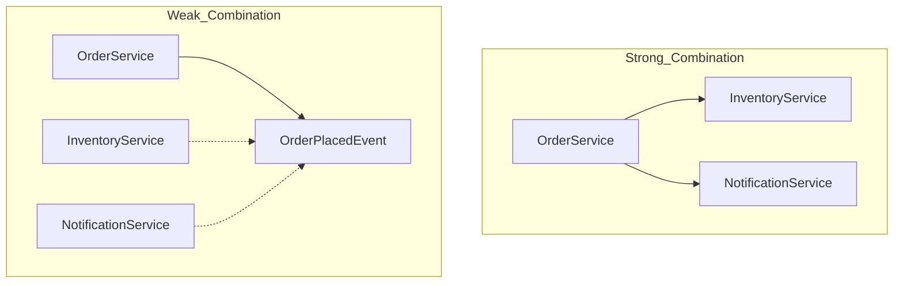

# Overview
_This document summarizes when to use a domain event._

# Introduction
A **Domain Event** is an event representing a past occurrence in the domain that can have a meaningful impact on other parts of the system.  
Domain events help resolve strong coupling issues — they allow you to inform related objects of state changes while maintaining low dependency and strong independence.

Below is a simple example expressed in `mermaid`:

# When to Use Domain Events

Domain events offer many advantages: reduced coupling, improved scalability, asynchronous processing, and performance optimization.
However, overusing them can lead to performance degradation and unintended behaviors.
Therefore, you should establish clear criteria to prevent misuse.

**Consider using domain events when:**

1. **The state change of the domain model is a meaningful fact**

   * Used to announce the completion of specific business actions.
   * *Examples:* Order created, Payment completed, Sign-up succeeded.

2. **A reaction is needed across multiple bounded contexts (or modules)**

   * One event can trigger multiple actions without tightly coupling the modules.
   * With strong coupling, you’d need to propagate changes to each dependency manually.

3. **Eventual consistency or asynchronous processing is acceptable**

   * If transaction order is not critical, you can leverage asynchronous and eventual consistency benefits.

4. **You need auditing or history management based on events**

   * Enables tracking of who did what and when.
   * Plays a core role in event sourcing and event storage.

5. **You want to separate side effects**

   * Focus the core logic on essential work and delegate side effects through events.
   * Keeps the core logic clean while loosely coupling secondary processes.

# Final Thoughts

A domain event is a powerful design pattern.
When applied correctly, it can become a strong asset to your system. However, if misused, it can harm performance and maintainability.
Use domain events thoughtfully, guided by the principles outlined in this document.

