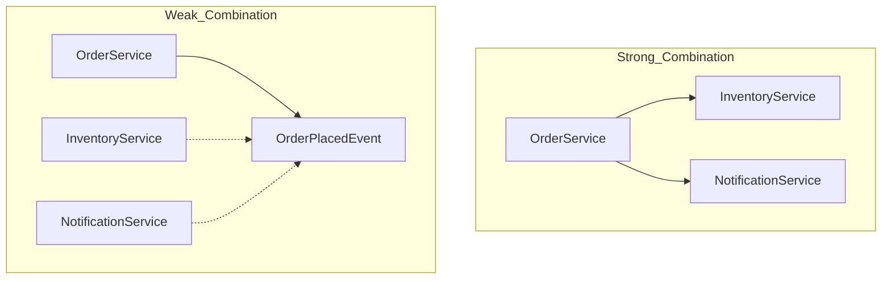

# 개요
_이 문서는 도메인 이벤트를 언제 사용해야 하는지 정리한 것이다._

# 서론
**도메인 이벤트(Domain Event)** 는 도메인에서 발생한 과거의 사건 중 다른 부분에 의미 있는 영향을 줄 수 있는 이벤트를 말한다.  
도메인 이벤트는 강한 결합 문제를 해결하는 데 도움을 준다. 이를 통해 관련 객체에 상태 변화를 알리면서도 낮은 의존성과 높은 독립성을 유지할 수 있다.

아래는 `mermaid`로 표현한 간단한 예시이다.

# 도메인 이벤트를 사용할 시점

도메인 이벤트는 결합도 감소, 확장성 향상, 비동기 처리, 성능 최적화 등 많은 장점을 제공한다.
하지만 남용하면 성능 저하나 의도치 않은 동작이 발생할 수 있으므로, 기준을 세워 신중하게 사용해야 한다.

**도메인 이벤트 사용을 고려할 상황:**

1. **도메인 모델의 상태 변화가 의미 있는 사실일 때**

   * 특정 비즈니스 작업의 완료를 알릴 때 사용한다.
   * *예시:* 주문 생성, 결제 완료, 회원가입 성공.

2. **여러 바운디드 컨텍스트(또는 모듈)에서 반응이 필요할 때**

   * 하나의 이벤트로 여러 동작을 유발할 수 있다.
   * 강한 결합이라면 모든 연결된 모듈에 변경 사항을 직접 전달해야 한다.

3. **최종 일관성이나 비동기 처리가 가능할 때**

   * 트랜잭션 내 처리 순서가 중요하지 않다면 비동기와 최종 일관성의 장점을 활용할 수 있다.

4. **이벤트 기반 감사 및 이력 관리가 필요할 때**

   * 누가, 언제, 무엇을 했는지 추적할 수 있다.
   * 이벤트 소싱 및 이벤트 저장소에서 핵심 역할을 한다.

5. **부수 효과를 분리하고 싶을 때**

   * 핵심 로직에만 집중하고, 부수 효과는 이벤트로 분리할 수 있다.
   * 핵심 로직을 유지하면서 부수 처리와 느슨하게 결합시킨다.

# 마무리

도메인 이벤트는 매우 강력한 설계 패턴이다.
잘 사용하면 시스템의 큰 무기가 되지만, 남용하면 성능과 유지보수성을 해칠 수 있다.
이 문서에서 제시한 원칙을 고려하며 신중하게 도메인 이벤트를 사용해야 한다.

