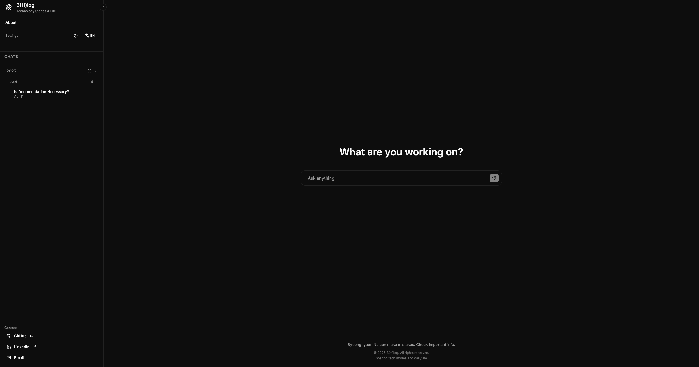

# B(H)log - Personal Blog with Chat Interface



[](https://nextjs.org/)
[](https://www.typescriptlang.org/)
[](https://pages.cloudflare.com/)
[](https://www.anthropic.com/)


Next.js 14로 구축된 현대적인 개인 블로그로, 챗봇 스타일의 인터페이스를 갖추고 있습니다. 다크/라이트 모드, 다국어(한국어/영어) 지원, 그리고 독특한 말풍선 형태의 포스트 레이아웃이 특징입니다.

-----

## ✨ 기능

  - **채팅 스타일 인터페이스**: 포스트가 교대로 나타나는 채팅 말풍선(사용자/봇 스타일)으로 표시됩니다.
  - **다국어**: `next-intl`을 이용한 한국어 및 영어 완벽 지원.
  - **다크/라이트 모드**: 시스템 설정 감지를 통한 자연스러운 테마 전환.
  - **MDX 지원**: 커스텀 컴포넌트와 구문 강조를 포함한 풍부한 콘텐츠.
  - **크기 조절 가능한 사이드바**: 드래그 가능한 사이드바로, 너비 설정이 유지됩니다.
  - **고급 검색**: 하이라이팅 및 필터링 기능이 포함된 전체 텍스트 검색.
  - **댓글**: Giscus 댓글 시스템 통합.
  - **반응형 디자인**: Tailwind CSS를 활용한 모바일 우선 접근 방식.
  - **정적 내보내기**: GitHub Pages 또는 모든 정적 호스팅 서비스에 배포 가능.
  - **SEO 최적화**: 구조화된 데이터, 메타 태그, 사이트맵 생성.

-----

## 🛠 기술 스택

  - **프레임워크**: Next.js 14 (App Router)
  - **언어**: TypeScript
  - **스타일링**: Tailwind CSS
  - **콘텐츠**: `next-mdx-remote`를 활용한 MDX
  - **다국어**: `next-intl`
  - **댓글**: Giscus
  - **아이콘**: Lucide React
  - **배포**: GitHub Pages / Vercel

-----

## 📁 프로젝트 구조

```
my-blog/
├── src/
│   ├── app/                 # Next.js App Router
│   │   ├── [locale]/        # 다국어 라우트
│   │   └── globals.css      # 전역 스타일
│   ├── components/          # React 컴포넌트
│   │   ├── ChatInterface.tsx
│   │   ├── PostContent.tsx
│   │   ├── Sidebar.tsx
│   │   ├── Giscus.tsx
│   │   └── WelcomeMessage.tsx
│   ├── content/             # MDX 블로그 포스트
│   │   ├── en/              # 영어 포스트
│   │   └── ko/              # 한국어 포스트
│   ├── lib/                 # 유틸리티 함수
│   └── messages/            # i18n 번역 파일
├── public/                  # 정적 파일
├── .github/workflows/       # GitHub Actions
└── package.json
```

-----

## 🚀 시작하기

### 사전 준비 사항

  - Node.js 18.0 이상
  - npm 또는 yarn

### 설치

1.  저장소 복제:

<!-- end list -->

```bash
git clone <repository-url>
cd my-blog
```

2.  의존성 설치:

<!-- end list -->

```bash
npm install
```

3.  개발 서버 실행:

<!-- end list -->

```bash
npm run dev
```

4.  브라우저에서 [http://localhost:3000](https://www.google.com/search?q=http://localhost:3000)을 엽니다.

-----

## 📝 콘텐츠 관리

### 새 포스트 추가하기

1.  적절한 언어 폴더에 새 MDX 파일을 생성합니다:

      - 한국어: `src/content/ko/your-post-slug.mdx`
      - 영어: `src/content/en/your-post-slug.mdx`

2.  MDX 파일에 프론트매터를 추가합니다:

<!-- end list -->

```mdx
---
title: "당신의 포스트 제목"
excerpt: "당신의 포스트에 대한 간단한 설명"
date: "2024-01-01"
tags: ["nextjs", "react", "blog"]
readingTime: 5
---

# 첫 번째 섹션 (사용자 메시지)

이것은 사용자 메시지 말풍선으로 나타납니다.

# 봇 응답

이것은 봇 응답 말풍선으로 나타납니다.

# 또 다른 사용자 메시지

포스트는 자동으로 사용자 및 봇 스타일로 번갈아 표시됩니다.
```

### 포스트 구조

포스트는 `# H1` 헤딩을 기준으로 자동으로 채팅 말풍선으로 분리됩니다:

  - **짝수 인덱스 (0, 2, 4...)**: 사용자 메시지 (오른쪽 정렬, 기본 색상)
  - **홀수 인덱스 (1, 3, 5...)**: 봇 응답 (왼쪽 정렬, 카드 배경)

-----

## 🎨 커스터마이징

### 테마 설정

`tailwind.config.js`를 수정하여 색상과 테마를 커스터마이징하세요:

```js
module.exports = {
  theme: {
    extend: {
      colors: {
        primary: {
          // 당신의 커스텀 기본 색상
        }
      }
    }
  }
}
```

### Giscus 댓글

`src/components/Giscus.tsx` 파일에서 Giscus 설정을 업데이트하세요:

1.  플레이스홀더 값을 당신의 저장소 정보로 대체합니다.
2.  필요에 따라 카테고리 및 기타 설정을 구성합니다.

### 컴포넌트와 ./src/messages 수정
의외에도 몇가지 하드코딩되어있는 정보를 자신의 정보에 맞게 수정하세요

-----

## 📦 배포

### GitHub Pages

이 프로젝트는 GitHub Actions를 사용하여 GitHub Pages에 자동 배포되도록 구성되어 있습니다.

1.  `main` 브랜치에 푸시합니다.
2.  GitHub Actions가 자동으로 빌드하여 GitHub Pages에 배포합니다.

### 수동 배포

```bash
# 정적 파일 빌드 및 내보내기
npm run build

# 'out' 디렉토리에 정적 파일이 생성됩니다.
# 원하는 정적 호스팅 서비스에 업로드하세요.
```

### Vercel (대안)

GitHub 저장소를 Vercel에 연결하면 자동으로 배포됩니다.

-----

## 🌐 국제화

블로그는 한국어와 영어를 지원합니다:

  - **URL**: `/ko/post/slug` 또는 `/en/post/slug`
  - **메시지**: `src/messages/[locale].json`에 저장됩니다.
  - **콘텐츠**: 각 언어별로 별도의 MDX 파일을 사용합니다.

### 새 언어 추가하기

1.  메시지 파일 생성: `src/messages/[locale].json`
2.  `src/lib/i18n.ts`에 로케일 추가
3.  미들웨어 설정 업데이트
4.  콘텐츠 폴더 생성: `src/content/[locale]/`

-----

## 🛠 사용 가능한 스크립트

  - `npm run dev` - 개발 서버 시작
  - `npm run build` - 프로덕션 빌드
  - `npm run start` - 프로덕션 서버 시작
  - `npm run lint` - ESLint 실행
  - `npm run type-check` - TypeScript 타입 검사 실행
  - `npm run deploy` - 정적 호스팅을 위한 빌드 및 내보내기

-----

## 🎯 주요 기능 설명

### 채팅 인터페이스

독특한 채팅 인터페이스는 기존의 블로그 포스트를 대화형 형식으로 바꿔, 콘텐츠를 더 흥미롭고 읽기 쉽게 만듭니다.

### 크기 조절 가능한 사이드바

사이드바 너비는 다음과 같은 특징을 가집니다:

  - 데스크톱에서 드래그 가능
  - 세션 간 설정 유지
  - 더 넓은 읽기 공간을 위해 접기 가능
  - 모바일 기기에서 반응형으로 작동

### 고급 검색

전체 텍스트 검색은 다음을 포함합니다:

  - 콘텐츠 하이라이팅
  - 태그별 필터링
  - 날짜/제목/읽는 시간별 정렬
  - 검색 결과 요약

### 성능 최적화

  - 정적 내보내기 지원
  - 최적화된 번들 크기
  - 이미지 최적화
  - CSS 압축
  - 컴포넌트 지연 로딩

-----

## 📄 라이선스

이 프로젝트는 오픈 소스이며 [MIT 라이선스](https://www.google.com/search?q=LICENSE)를 따릅니다.

## 🤝 기여하기

기여를 환영합니다\! 자유롭게 Pull Request를 제출해주세요.

## 📧 연락처

  - GitHub: [iamb0ttle](https://github.com/iamb0ttle)
  - 이메일: nbhyun0329@gmail.com
  - LinkedIn: [byeonghyeon-na](https://www.linkedin.com/in/byeonghyeon-na/)

-----

Next.js 14와 TypeScript, 그리고 환상적인 나의 ultrathink 동료 Claude Code와 함께 ❤️를 담아 만들었습니다.